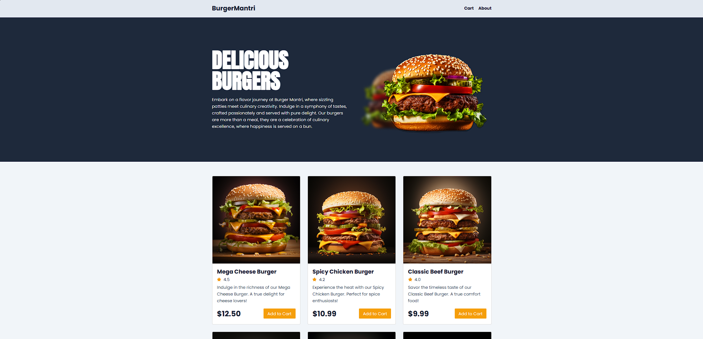
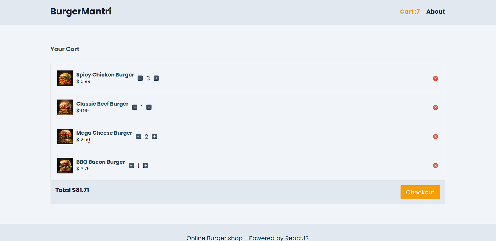

# burger-mantri
Savor the flavor with BurgerMuncher, a cutting-edge burger ordering application that tantalizes taste buds. Leveraging advanced technologies and a user-friendly interface, this app takes your burger experience to the next level.

## Features

- Dynamic Burger Selection:
Explore a diverse menu of mouthwatering burgers, each with its unique blend of ingredients and flavors. Customize your order effortlessly, from patty preferences to toppings galore.

- Lazy Loading for Speed:
Experience swift and efficient page loading with lazy loading techniques. Only the essential components are loaded, ensuring a speedy and responsive user interface.

- Router Magic:
Navigate through the app effortlessly with React Router. Enjoy smooth transitions between pages, making your burger selection process a breeze.

- Fetch Data with Router Loader:
Elevate your burger choices with real-time data fetched seamlessly using router loader. Stay updated on the latest additions to the menu without missing a beat.

- Redux Toolkit for State Management:
Utilize the power of Redux Toolkit for efficient state management. Keep track of your cart items, ensuring a flawless and synchronized user experience.

- Cart Management:
Add to your cart with a click, remove items at your convenience, and watch your order summary update in real-time. Enjoy a hassle-free and intuitive cart management system.

- Individual Product Pages:
Dive deep into the details of each burger with individual product pages. Get a closer look at the ingredients, nutritional information, and customer reviews before making your decision.

## Technologies Used

- React
- Redux Toolkit
- React Router
- Lazy Loading
- Fetch Data with Router Loader
- CSS for Styling

Bite into the future of burger ordering with BurgerMuncher — where innovation meets indulgence!

## Live Demo

## Home

## Cart
